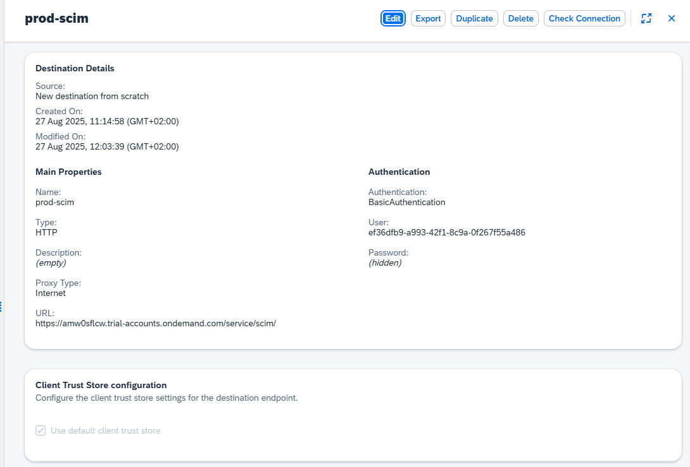
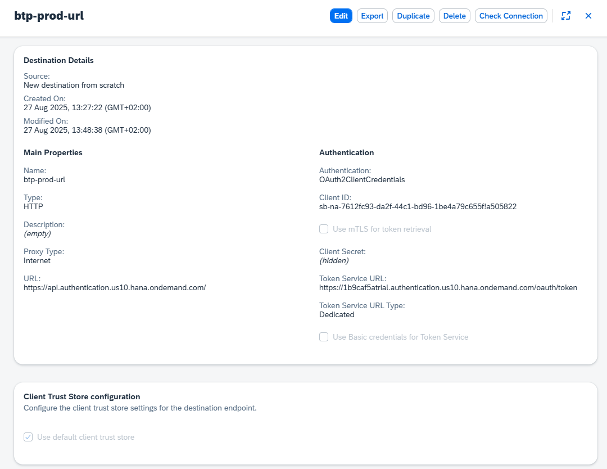

# URV APP
This app is meant to be used as an application to monitor roles, role collections and groups in your sap environment.     
This is a CAP app without a database 
- Retreiving data from destinations => see screenshots

## Get BTP data

GET TOKEN (jwt voor BTP role collections https://api.authentication.us10.hana.ondemand.com/sap/rest/authorization/v2/rolecollections)
- Maak instance van Authorization and Trust Management Service (apiaccess, niet application of instance)
    => create service key

## Get CIS data

GET TOKEN VOOR CIS 
1.  Create ADMINISTRATOR (SYSTEM not user)
2.  Create secret (save credentials) 
3.  BASIC AUTH => id + secret for 
https://adruyadgk.trial-accounts.ondemand.com/service/scim/Groups

## Make destination for deployed app
Create these destinations for each subaccount / scim  

## Add new subaccount / BTP
- Create new destination for subaccount (prod, dev, acc, ...)
- Change code to add subaccounts in frontend (add option in dropdown)
- Add in interactions.js the subaccount in SCIM_DESTINATION_MAP
